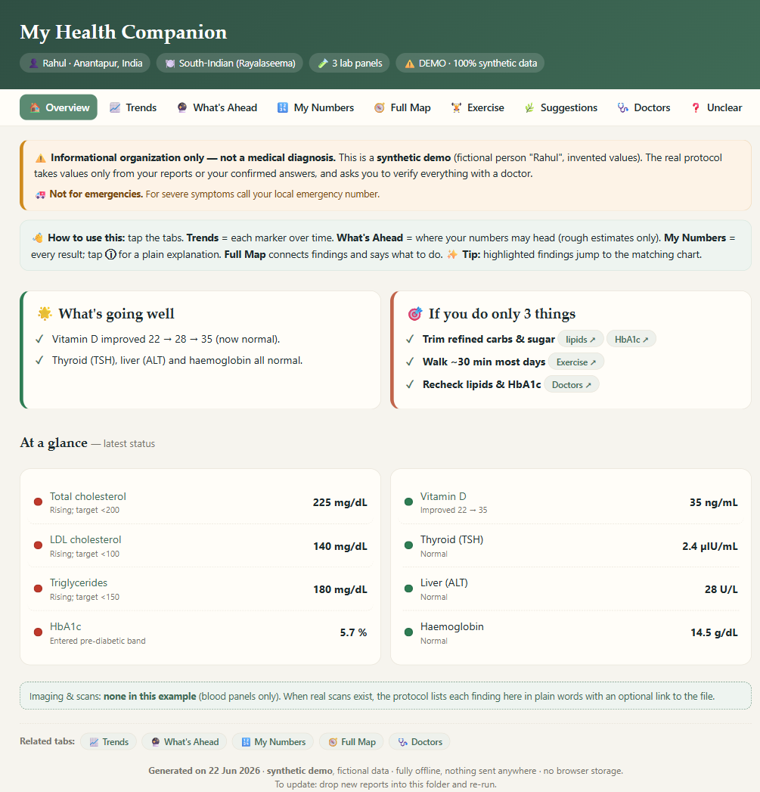
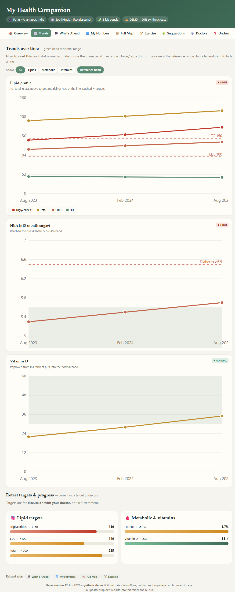
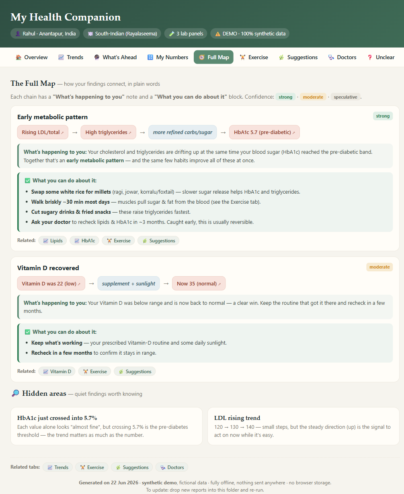
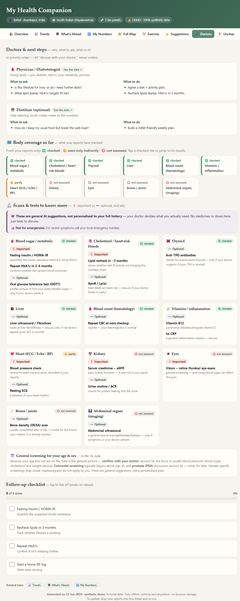

# 🩺 Health Report Analysis Protocol

> Turn a folder of personal medical reports into a clear, traceable, **fully‑offline** health
> dashboard — using [Claude Code](https://claude.com/claude-code).

Point Claude Code at a folder of your lab reports, imaging, ECG/Echo/TMT, prescriptions and eye
reports, and this protocol guides it to produce:

- a **traceable extraction** — every value linked back to its source file (nothing invented);
- **trend analysis** across dates, with reference‑range bands;
- **interlinks** between findings — *what's happening to you* **and** *what you can do about it*;
- a single **self‑contained, offline HTML dashboard** a non‑medical person can understand alone.

**It never diagnoses, never invents values, explains everything in plain language, and keeps all
your data on your own machine.**

`Apache‑2.0` · `v1.0.0` · 9‑tab dashboard · 100% offline



## ⚡ Install

**In Claude Code** (works today — installs straight from this repo):
```text
/plugin marketplace add rahul1996pp/health-report-protocol
/plugin install health-report-analysis@health-tools
```

Or **zero‑setup**: copy [`CLAUDE.md`](CLAUDE.md) into a folder of your reports and run `claude`.
(Both paths explained in [Use it — two ways](#-use-it--two-ways).)

---

## ⚠️ Disclaimer & privacy (read first)

- **Not medical advice.** This is informational *organization* only — always confirm findings
  with a qualified doctor. **Not for emergencies** (for severe symptoms call your local
  emergency number).
- **Your data stays on your machine.** The protocol never uploads anything and the dashboard is
  fully offline. **This repository contains no personal health data** — only the protocol and a
  100% synthetic example. See [`PRIVACY.md`](PRIVACY.md) for the full statement (including the one
  caveat — the AI itself processes what it reads, per Anthropic's policy).

---

## ✨ What the dashboard gives you

A single offline HTML file with 9 tabs:

| Tab | What it shows |
|---|---|
| **Overview** | Disclaimer, "what's going well", an at‑a‑glance status list, and a calm urgent banner only if something is critical |
| **Trends** | Each marker over time with the normal range shaded; plus retest‑target progress bars |
| **What's Ahead** | Where your own numbers are heading — caveated projections, risk trajectory, and qualitative "conditions to watch" (estimates only, never a forecast — confirm with your doctor) |
| **My Numbers** | Every result, grouped by body system, each with a plain‑language `ⓘ` explanation |
| **Full Map** | How findings connect, with *"what's happening to you"* + *"what you can do about it"* |
| **Exercise** | A friendly guide with the *why*, tied to your own numbers |
| **Suggestions** | Practical tips — including **location‑aware "can enjoy" vs "best to have rarely"** lists for foods, fruits & drinks in your own cuisine |
| **Doctors** | Who to see, what to ask, what to do; a **body‑coverage grid** (what's been checked vs. not) and suggested scans/tests split **❗ Important / ➖ Optional** (from your findings + general whole‑body screening, age/sex‑gated) — all "discuss with your doctor" — plus a checklist |
| **Unclear** | What you confirmed vs. what still needs verifying |

Everything is cross‑linked — tap any finding to jump to its chart or number.

---

## 🚀 Use it — two ways

### Path A · Drop‑in `CLAUDE.md` (simplest, zero config)
Claude Code auto‑loads a `CLAUDE.md` from the working directory.
```bash
cp CLAUDE.md /path/to/your/health-reports/   # your own (separate) folder
cd /path/to/your/health-reports/
claude
# then ask:  "Analyze the health reports in this folder following CLAUDE.md"
```

### Path B · Install as a plugin (versioned, reusable everywhere)
```text
/plugin marketplace add rahul1996pp/health-report-protocol
/plugin install health-report-analysis@health-tools
/health-report-analysis
```

---

## 👀 See it in action (synthetic demo)

The [`examples/`](examples/) folder is **100% made up** (a fictional "Rahul" in Anantapur, India):

- fake input reports → [`examples/sample-reports/`](examples/sample-reports/)
- the extraction & analysis it produces → [`examples/sample-output/`](examples/sample-output/)
- a full **demo dashboard** → [`examples/sample-output/sample_dashboard.html`](examples/sample-output/sample_dashboard.html)
  *(download it and open in any browser — it works with the internet off)*

**Trends** — every marker over time with the normal range shaded, plus retest‑target bars:



**Full Map** — how findings connect, each with *"what's happening to you"* and *"what you can do about it"*:



**Doctors** — who to see and what to ask, a **body‑coverage grid** (what's been checked vs. not), and scans/tests split into **❗ important** and **➖ optional** (your findings + general screening, age/sex‑gated) — all "discuss with your doctor":



---

## 📂 Repository layout

```
health-report-protocol/
├── CLAUDE.md                      # the protocol (Path A — source of truth)
├── .claude-plugin/marketplace.json
├── plugins/health-report-analysis/
│   ├── .claude-plugin/plugin.json
│   └── skills/health-report-analysis/SKILL.md   # same protocol, as a Skill (Path B)
├── examples/                      # 100% synthetic demo
├── docs/screenshots/              # images used in this README
├── LICENSE · NOTICE · CITATION.cff
└── README.md
```

> The protocol body lives in **`CLAUDE.md`** and inside **`SKILL.md`** (after its YAML
> frontmatter). If you edit one, copy the change to the other so they stay in sync.

---

## 📜 License & credit

Licensed under the **[Apache License 2.0](LICENSE)**. You're free to use, modify and build on it
(including commercially), **provided you keep the copyright/attribution and `NOTICE`, and state
any changes** you make.

Created by **Rahul** · [@rahul1996pp](https://github.com/rahul1996pp). Please keep the
attribution; a [`CITATION.cff`](CITATION.cff) is included so GitHub shows a **"Cite this
repository"** button.

Informational only — **not** medical advice, diagnosis, or treatment.
